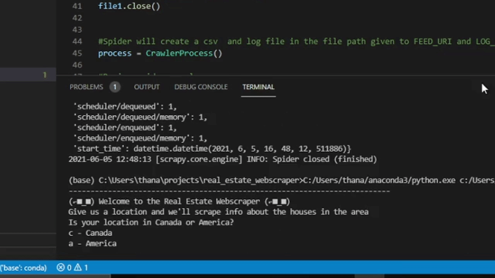

 <!-- PROJECT LOGO -->
<br />
<p align="center">
  <a>
    
  </a>
 
   <p align="center">
    Collect the home info anywhere in Canada and America!
    <br />
    By inputting a country and location, the spider will collect info on all homes in the specified area into an excel file.
    <br />
    <a href="https://github.com/Dhirru12/Real-Estate-Webscraper/blob/main/README.md"><strong>Explore the docs »</strong></a>
    <br />
    <br />
    <a href="https://github.com/Dhirru12/Real-Estate-Webscraper/blob/main/real_estate_webscraper/spiders/house_info.py">View Code</a>
    ·
    <a href="https://github.com/Dhirru12/Real-Estate-Webscraper/issues">Report Bug or Request Feature</a>
  </p>
</p>

<!-- ABOUT THE PROJECT -->
## What is The Real Estate Webscraper?
The real estate industry is always changing, so I created a bot that records its current conditions for your convienience!

By simply inputting whether your location is within America or Canada and the location itself, this bot will scrape all info on all the homes in the area!

<p float="left" align="center">
   
   
   
</p>


What can I use this program for?
* Record current prices of homes in a location
* Real estate back of the envelope analysis
* Record homes available for sale


### Built With
* [Selenium](https://www.selenium.dev)
* [Scrapy](https://scrapy.org/)


<!-- GETTING STARTED -->
## Getting Started

Follow these intructions to get Instagram MultiDM started!

### Prerequisites

You only need Selenium and Scrapy as a prequisite
  ```sh
  pip install selenium
  ```
  
  ```sh
  pip install scrapy
  ```

### Installation

1. Clone the repo
   ```sh
   git clone https://github.com/Dhirru12/Real-Estate-Webscraper.git
   ```
   

<!-- USAGE EXAMPLES -->
## Usage

I will put images here when I can


<!-- CONTRIBUTING -->
## Contributing

I feel like this bot can expand to be so much more, especially with inspiration from my Instagram Discord Bot. Any contributions you make are **greatly appreciated**.

1. Fork the Project
2. Create your Feature Branch (`git checkout -b feature/AmazingFeature`)
3. Commit your Changes (`git commit -m 'Add some AmazingFeature'`)
4. Push to the Branch (`git push origin feature/AmazingFeature`)
5. Open a Pull Request
